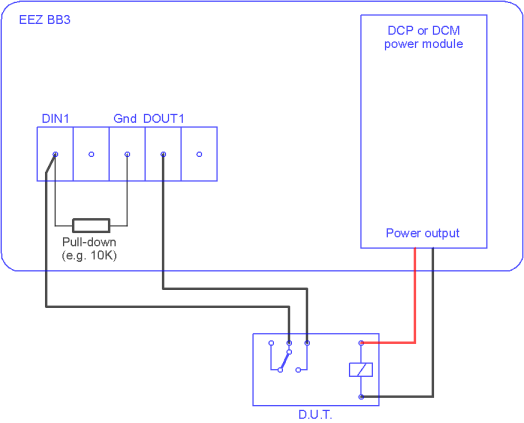

### About

[Node-RED](https://nodered.org/) flow used in [EEZ BB3 user manual](https://www.envox.hr/eez/eez-bench-box-3/bb3-user-manual/17-node-red-integration.html)

### Required Node-RED packages

* [@eez-open/node-red-contrib-bb3](https://flows.nodered.org/node/@eez-open/node-red-contrib-bb3)
* [node-red-contrib-counter](https://flows.nodered.org/node/node-red-contrib-counter)
* [node-red-dashboard](https://flows.nodered.org/node/node-red-dashboard)

### Wiring diagram

### Dashboard

